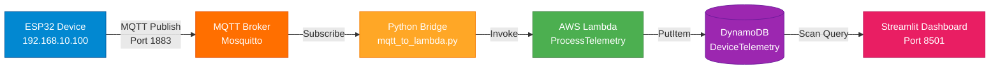

# IoT-Enabled Motor Control System and Telemetry System with AWS LocalStack

A complete end-to-end IoT data pipeline that simulates an ESP32 device with motor control and safety interlocks sending real-time telemetry through MQTT, processes it with AWS Lambda, stores it in DynamoDB, and visualizes everything on a live Streamlit dashboard. Built entirely on LocalStack for local AWS development.

## What This Project Does

This system simulates a real IoT deployment where an ESP32 microcontroller monitors temperature and current draw from a servo motor sweep system. The device publishes telemetry data over MQTT to a public broker, which then gets processed through AWS serverless infrastructure before being displayed on a web dashboard.

The whole thing runs locally using LocalStack, so there's no cloud costs while developing and testing. Everything is automated through a single launcher script.

## System Architecture


## Network Topology Table 

### Network Segmentation

| VLAN | Segment | Network | Purpose | Devices | Security |
|------|---------|---------|---------|---------|----------|
| **VLAN 10** | IoT Device Zone | 192.168.10.0/24 | Field devices, sensors | ESP32 (192.168.10.100)<br/>WAP (192.168.10.1) | • Isolated from backend<br/>• No internet access<br/>• Firewalled |
| **VLAN 20** | DMZ | 192.168.20.0/24 | Message broker services | MQTT Broker (192.168.20.10) | • Public-facing services<br/>• ACL restrictions<br/>• Traffic inspection |
| **VLAN 30** | Secure Backend | 192.168.30.0/24 | Compute & storage | Lambda (192.168.30.20)<br/>DynamoDB (192.168.30.30) | • No direct device access<br/>• Private subnet<br/>• IAM policies |
| **VLAN 99** | Management | 192.168.99.0/24 | Admin & monitoring | Dashboard (192.168.99.50) | • Admin access only<br/>• Separate from production<br/>• Audit logging |

### Firewall Rules (ACLs)

```
VLAN 10 → VLAN 20:  PERMIT tcp port 1883 (MQTT only)
VLAN 20 → VLAN 30:  PERMIT tcp port 4566 (Lambda invoke only)
VLAN 30 → VLAN 30:  PERMIT all (internal backend)
VLAN 99 → ANY:      PERMIT all (management)
ANY → VLAN 10:      DENY all (no inbound to IoT)
```

### Port Mapping

| Service | Port | Protocol | Access |
|---------|------|----------|--------|
| MQTT Broker | 1883 | TCP | VLAN 10 → VLAN 20 |
| LocalStack Lambda | 4566 | TCP | VLAN 20 → VLAN 30 |
| Streamlit Dashboard | 8501 | HTTP | VLAN 99 only |
| SSH Management | 22 | TCP | VLAN 99 only |

---

## Architecture Overview
```
ESP32 (Wokwi Simulator)
    |
    | MQTT publish to localhost:1883
    v
Mosquitto Broker (Docker)
    |
    | Messages forwarded to
    v
Python MQTT Bridge
    |
    | Invokes Lambda function
    v
AWS Lambda in LocalStack (Docker)
    |
    | Filters & stores data
    v
DynamoDB in LocalStack (Docker)
    |
    | Scans for latest data
    v
Streamlit Dashboard (auto-refreshing)
```

## Technologies Used

- **ESP32 (C)**: FreeRTOS-based firmware with sensor simulation, PWM servo control, and MQTT client
- **Python**: MQTT bridge, Lambda function, and Streamlit dashboard
- **MQTT**: Publish/subscribe messaging using Mosquitto broker (local or public)
- **Docker & Docker Compose**: Container orchestration for LocalStack and Mosquitto
- **AWS Lambda**: Serverless data processing with filtering logic
- **DynamoDB**: NoSQL database with TTL for automatic data retention
- **Streamlit**: Real-time web dashboard with Plotly charts
- **LocalStack**: Local AWS cloud stack for development
- **Bash**: Infrastructure automation and service orchestration

## How This Relates to My Certifications

### CCNA (Networking)

**What I Applied:**
- Set up MQTT over TCP/IP (port 1883) using the OSI model concepts
- Configured WiFi connectivity on ESP32 with proper SSID/authentication
- Worked with client-server architecture (ESP32 as client, Mosquitto as broker)
- Understood the difference between localhost (127.0.0.1) and public broker addressing
- Implemented publish/subscribe messaging patterns which relate to network topology concepts

**Real-World Parallel:**
This project is basically a small-scale version of how industrial IoT networks operate. The ESP32 acts like a field device on a remote site, MQTT is the communication protocol (similar to how SCADA systems work), and the cloud infrastructure processes and stores the data. In a production environment, you'd have VLANs, firewalls, and proper network segmentation, but the fundamentals are the same.

### Security+ (Security)

**What I Applied:**
- **Authentication & Access Control**: AWS credentials (even though they're test credentials for LocalStack, the pattern is production-ready)
- **Fault Detection & Response**: Automated shutdown on critical conditions (temp >= 34C, current >= 1.7A) - similar to intrusion detection systems
- **Safety Interlocks**: Multi-condition logic prevents unauthorized restart during fault state (principle of least privilege applied to device operation)
- **Audit Logging**: All telemetry including fault events stored in DynamoDB with timestamps for incident investigation
- **Data Retention Policies**: TTL configured to avoid storing data longer than necessary (compliance requirement)
- **Emergency Response Procedures**: Physical stop button acts as emergency shutdown mechanism (incident response)
- **Continuous Monitoring**: Real-time telemetry streaming enables detection of anomalous behavior patterns

**Security Considerations:**
The MQTT broker is currently public (test.mosquitto.org) or unauthenticated local (Docker), which is fine for development but wouldn't fly in production. In a real deployment, you'd use AWS IoT Core with certificate-based authentication, TLS encryption, and IAM policies. The Lambda function would also need proper VPC configuration and CloudWatch logging for audit trails.

**Safety as Security:**
The fault detection system demonstrates defense-in-depth principles. Multiple layers prevent dangerous operation: threshold monitoring (detection), automatic shutdown (prevention), safety interlocks (access control), and persistent logging (accountability). This parallels how security systems use layered controls to protect against threats.

**Security Considerations:**
The MQTT broker is currently public (test.mosquitto.org) which is fine for development but wouldn't fly in production. In a real deployment, you'd use AWS IoT Core with certificate-based authentication, TLS encryption, and IAM policies. The Lambda function would also need proper VPC configuration and CloudWatch logging for audit trails.

### AWS Cloud Practitioner

**What I Applied:**
- **Serverless Architecture**: Used Lambda for compute without managing servers
- **NoSQL Database**: Implemented DynamoDB with partition key (device_id) and sort key (timestamp)
- **Pay-per-request Billing**: Configured DynamoDB in on-demand mode
- **IAM Roles**: Lambda execution role (simulated in LocalStack)
- **Event-driven Processing**: Lambda triggered by MQTT bridge, processes data asynchronously
- **Data Lifecycle**: Implemented TTL for automatic data cleanup (cost optimization)
- **Infrastructure as Code**: Bash script automates resource creation

**AWS Services Demonstrated:**
- AWS Lambda (compute)
- DynamoDB (database)
- AWS CLI (management)
- boto3 SDK (programmatic access)

Even though this runs on LocalStack, the code is identical to what would run on real AWS. The only difference is the endpoint URL.

## Key Features

### Smart Data Filtering
The Lambda function only stores temperature readings if they've changed by more than 0.5 degrees from the last reading. This reduces database writes and storage costs. In a real production system with thousands of devices, this kind of filtering can save significant money.

### Automatic Data Cleanup
DynamoDB TTL automatically deletes records older than 7 days. Each record gets a timestamp when it's created, and DynamoDB handles the cleanup in the background. This prevents the database from growing indefinitely.

### Real-Time Dashboard
Streamlit auto-refreshes every 2 seconds and shows:
- Current temperature and current draw
- Status indicators (running/stopped/fault)
- Historical line charts for both metrics
- Warning indicators when values approach fault thresholds
- Raw data table for debugging

### One-Command Deployment
Single bash script handles everything:
- Creates DynamoDB table if it doesn't exist
- Enables TTL for data retention
- Packages and deploys Lambda function
- Starts MQTT bridge in background
- Launches Streamlit dashboard
- Monitors all processes and handles shutdown gracefully

## Key Safety Features

### Emergency Stop System
Physical stop button (`BTN_STOP_PIN`) provides immediate motor shutdown and fault reset. When pressed, the system:
- Stops servo movement immediately
- Clears all LED indicators
- Resets the fault state
- Allows safe restart

### Overcurrent Protection
Threshold-based fault detection monitors both temperature and current draw:
- **Temperature threshold**: 34°C
- **Current threshold**: 1.7A
- **Fault condition**: Both thresholds exceeded simultaneously
- **Response**: Immediate motor shutdown, red LED indication, system lockout

### Safety Interlocks
Multi-condition logic prevents unsafe operation:
- System cannot restart while in fault state (requires manual stop button reset)
- Start button only functions when no fault is present
- Servo duty cycle forced to zero during fault
- Green LED indicates safe operation, red LED indicates fault

### Cloud Telemetry
Real-time data streaming via MQTT provides remote monitoring:
- Temperature readings (°C)
- Current draw (Amps)
- Motor speed (steps/sec)
- System status (RUNNING/STOPPED/FAULT)
- Published every ~1 second for continuous monitoring

### Fault Logging
All telemetry data including fault states is stored in DynamoDB:
- Persistent record of when faults occurred
- Temperature and current values at time of fault
- Queryable history for trend analysis
- 3-day retention via TTL for compliance

## Project Structure
```

├── esp32_code.c              # ESP32 firmware (Wokwi simulator)
├── mqtt_to_lambda.py         # MQTT subscriber that invokes Lambda
├── lambda_function.py        # AWS Lambda data processor
├── dashboard.py              # Streamlit web dashboard
├── setup_localstack.sh       # All-in-one launcher script
├── docker-compose/           # Container configuration folder
│   └── docker-compose.yml    # Docker services (LocalStack + Mosquitto)
└── README.md                 # This file
```

## Docker Setup

This project includes a Docker Compose configuration that runs both LocalStack and a local Mosquitto MQTT broker. This eliminates the need to connect to the public test.mosquitto.org broker and keeps everything containerized.

### What's Included

**LocalStack Container:**
- Runs Lambda and DynamoDB services
- Exposes port 4566 for AWS API calls
- Persists data in `./localstack-data` volume

**Mosquitto Container:**
- Local MQTT broker on port 1883
- Runs without authentication for development
- Replaces the public test.mosquitto.org broker

## Setup and Installation

### Prerequisites
- Docker and Docker Compose
- Python 3.9+
- AWS CLI
- LocalStack running on localhost:4566
- Wokwi account (for ESP32 simulation)

### Quick Start

1. **Start Docker services with docker-compose**

2. **Run the setup_localstack**

3. **Access the dashboard**
Open browser to `http://localhost:8501`

4. **Start the ESP32 simulator**
Run the Wokwi simulation with the provided C code with its Diagram JSON file.

That's it. The script handles all infrastructure setup, starts the MQTT bridge, and launches the dashboard.

## Technical Decisions and Tradeoffs

### Why MQTT Instead of HTTP?
MQTT is designed for IoT. It's lightweight, and handles unreliable networks better than HTTP. The ESP32 can publish data without waiting for acknowledgment, which is important for resource-constrained devices.

### Why Lambda Instead of EC2?
Lambda scales automatically and you only pay for execution time. For sporadic IoT data (one reading per second), Lambda is way cheaper than keeping an EC2 instance running 24/7. Also, no server maintenance.

### Why DynamoDB Instead of RDS?
DynamoDB handles time-series data really well with its key schema (device_id + timestamp). It scales automatically and the on-demand pricing makes sense for variable IoT workloads. Also, TTL is built-in, whereas with RDS you'd need to write custom cleanup jobs.

### Why LocalStack?
Development costs are zero. You can test everything locally before deploying to real AWS. The code is identical between LocalStack and AWS, so there's no rewrite needed when you go to production.

## What I Learned

### Data Filtering is Critical
Without the 0.5 degree filter, the database would get hammered with writes every second even when nothing was changing. In production with hundreds of devices, this would get expensive fast.

### Serverless Has Constraints
Lambda has cold starts and execution time limits. For this use case it's perfect, but I learned you can't just throw any workload at Lambda. Had to think about function duration and memory allocation.

### Time-Series Data Needs Careful Schema Design
Using device_id as partition key and timestamp as sort key lets DynamoDB efficiently query recent data for a specific device. If I'd used timestamp as the partition key, queries would be slow because data would be spread across partitions.

### Background Processes Need Monitoring
The launcher script not only starts services but also monitors them. If the MQTT bridge crashes, the script detects it and shuts everything down gracefully. This kind of process management is important in production.

### Why Docker Compose?
Containerizing LocalStack and Mosquitto makes the setup reproducible across different machines. Instead of everyone needing to install and configure these services separately, docker-compose handles it all. The volumes ensure data persists between restarts, and the service definitions document exactly what ports and configurations are needed.

## Future Improvements

If I continue developing this:

- Add AWS IoT Core tintegration for production MQTT with TLS
- Implement SNS notifications for fault conditions
- Add more ESP32 devices and demonstrate multi-device aggregation
- Create CloudWatch dashboards for operaional metrics
- Add API Gateway + Lambda for mobile app integration
- Implement Cognito authentication for the dashboard
- Set up CI/CD pipeline with GitHub Actions
- Add CloudFormation templates for infrastructure as code

## Running Costs (if deployed to real AWS)

Based on typical IoT usage:
- Lambda: ~$0.50/month (1M requests, 128MB memory)
- DynamoDB: ~$2.50/month (25GB storage, on-demand reads/writes)
- Data Transfer: ~$0.50/month (minimal since it's mostly internal)
- **Total: Around $3-5/month for a single device**

With LocalStack, cost is $0 during development.

## License

This is a portfolio project for demonstration purposes.

## Contact

If you have questions about this project or want to discuss the technical implementation, feel free to reach out.